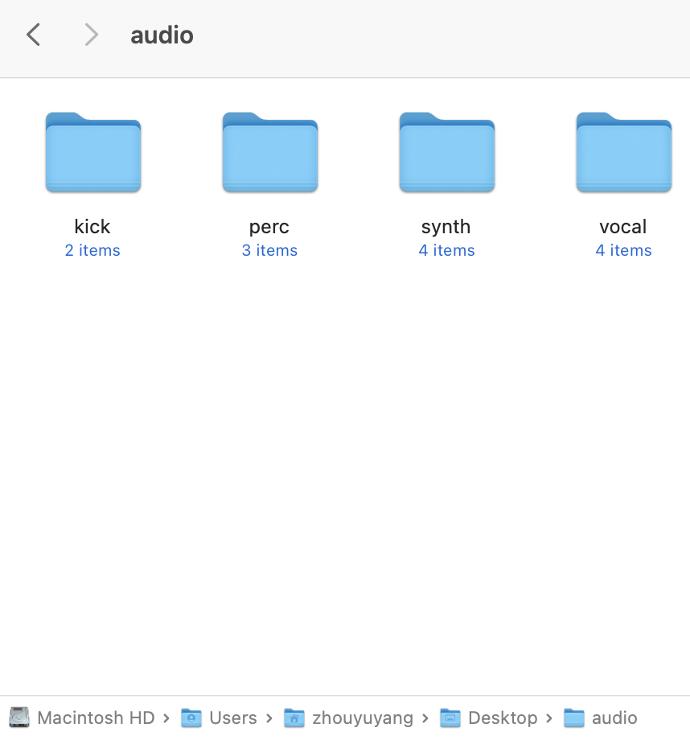
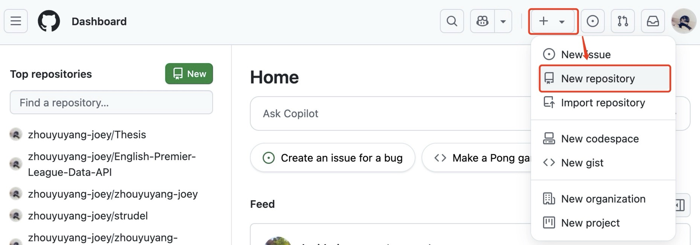
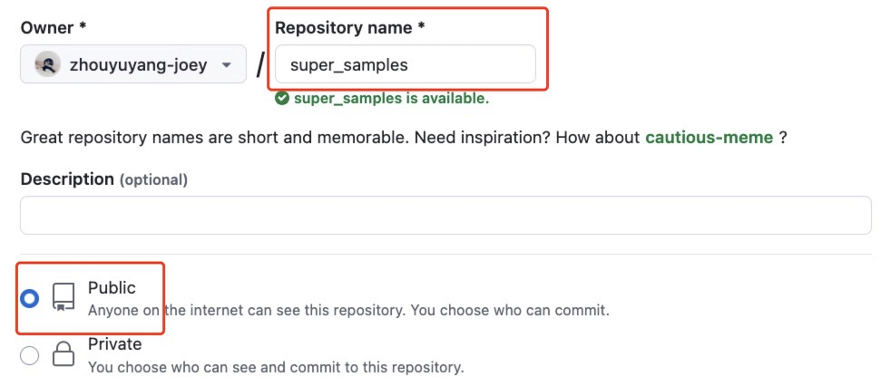
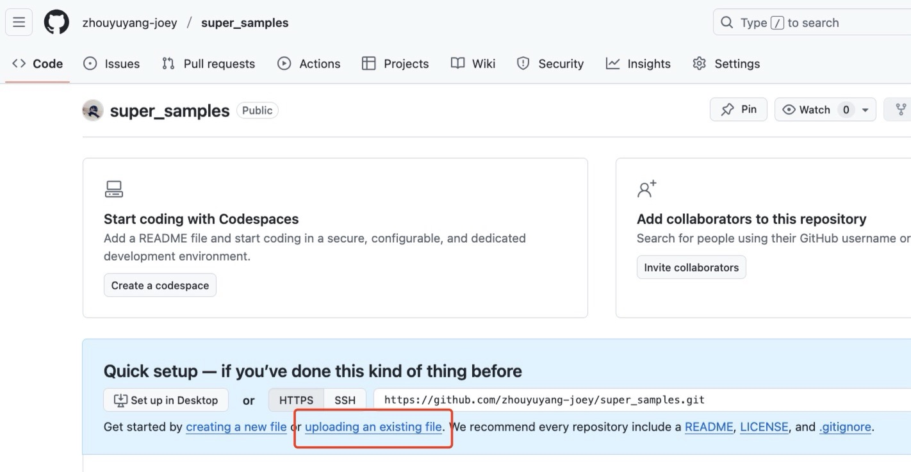
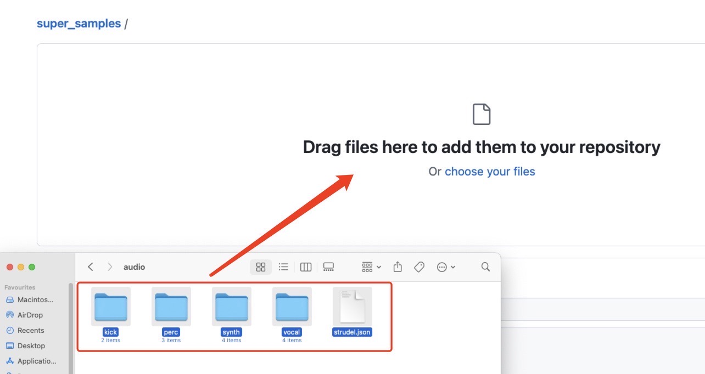
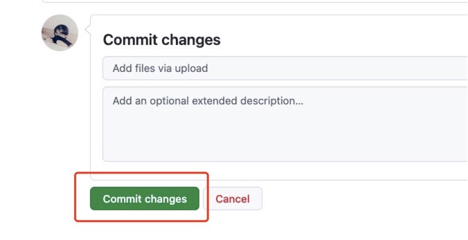

# strudel_json_generator
A Python script that can quickly generate a JSON file containing your sample information.

## Requirements
```python3```

## Usage
1. First, organize your audio samples into a root directory where each subfolder represents a sample category (e.g., `kick`, `perc`, `synth`,`vocal`). 

2. Clone my repository from terminal (or, if you are on Windows, open your command-line tool):
```
git clone https://github.com/zhouyuyang-joey/strudel_json_generator.git
```
And change the directory:

```
cd strudel_json_generator
```


3. Then, run the script using the following command structure:


```
python strudel_json_generator.py -p <path to the sample folders> -u <Your github username> -r <your github repo name>
```

To be more specific:

- `--path` or `-p`: **(Required)** The path to your root sample directory (In my case above, it is: /Users/zhouyuyang/Desktop/audio).

- `--username` or `-u`: **(Required)** Your GitHub username.

- `--repo` or `-r`: **(Required)** The name of the GitHub repository where the samples will be hosted.

- `--branch` or `-b`: (Optional) The repository branch name. Defaults to main, so you do not need to specify this if you have not made any changes.


For example, in my case, I would do it like this:
```
python generator.py -p /Users/zhouyuyang/Desktop/audio -u zhouyuyang-joey -r super_samples
```

This command will create a `strudel.json` file in the current directory.

## Final steps
- Create a GitHub repository with the same name as the one you specified in the command line.




- Upload all your sample folders & `strudel.json` to your GitHub repo (you probably will need to drag the folders to upload all the files).


And don't forget to commit changes.


Now, you should be able to load your samples in Strudel using GitHub 🎉🎉🎉

```
samples('github:<your user name>/<your repo name>>')
```
Again, in my case, it would be:
```
samples('github:zhouyuyang-joey/super_samples')
```
## Troubleshooting
If you made a mistake during the process and need to update the repo to fix it, you may find that strudel still does not load your samples correctly. 

Please refer to the following for a solution: [Loading Samples from a strudel.json file](https://strudel.cc/learn/samples/#loading-samples-from-a-strudeljson-file).

## Disclaimer
Due to copyright issues, I am unable to share the my repo I demonstrated in the document. 

This is because I only have the right to use these samples, but not the right to redistribute them. 

Sorry for any inconvenience.